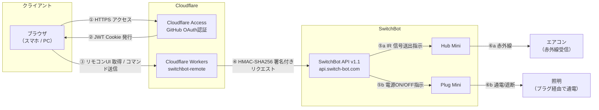
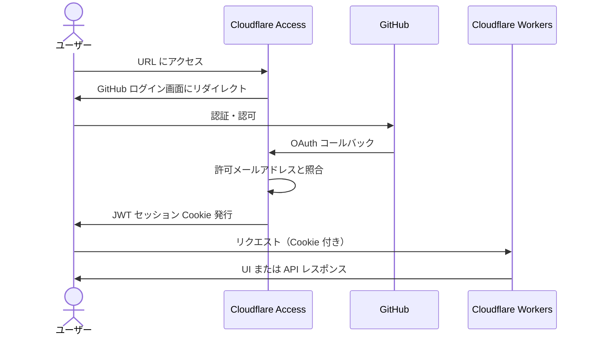
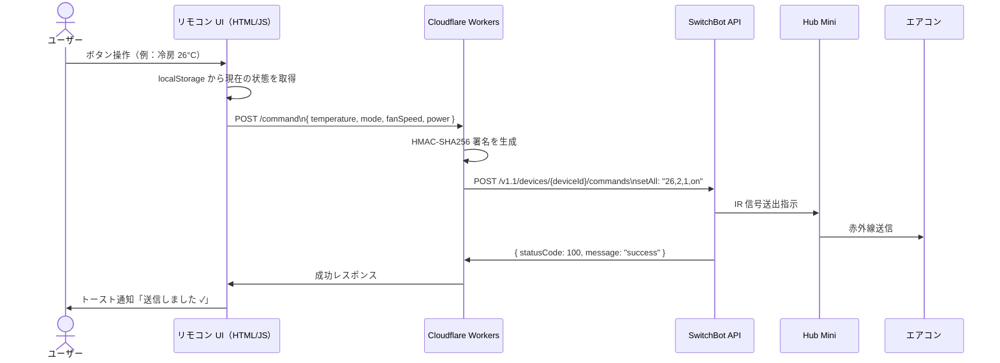

# switchbot-remote

SwitchBot APIとCloudflare Workers/Accessを使ったエアコン・プラグ・照明Webリモコン。  
GitHub認証付きのURLにアクセスするだけでスマホ・PCから自宅のエアコン・プラグ・照明を操作できる。1ページ内に「家のエアコン」「家のプラグ」「家の照明（赤外線）」のカードを縦に並べたシンプルな構成。

---

## システム全体像



---

## 認証フロー



---

## コマンド送信フロー



プラグも同様の流れだが、`GET /plugs` は一覧だけでなく各プラグの実際の電源状態も返す。Worker がプラグごとに SwitchBot API の `GET /v1.1/devices/{deviceId}/status` を呼び出し、`{ id, label, power }` の形でフロントに返すことで、ページ読み込み時点の正確なON/OFF状態を表示できる（本体・アプリ側で操作した場合もズレない）。`POST /plug-command` に `{ id, power: "on" | "off" }` を送信すると、Worker が該当プラグの `deviceId` を解決して SwitchBot API へ `turnOn` / `turnOff` コマンドを転送する。

---

## 技術選定

| 領域 | 採用技術 | 理由 |
|---|---|---|
| API 中継 | Cloudflare Workers (TypeScript) | エッジで動作・無料枠が大きい・Web Crypto API が使えるため外部ライブラリ不要 |
| 認証 | Cloudflare Access + GitHub OAuth | 設定のみで実装ゼロ・無料枠50ユーザー・個人利用に最適 |
| UI 配信 | Workers Static Assets | Workers と同一オリジンで配信できるため CORS 不要・別途 Pages デプロイも不要 |
| フロントエンド | Vanilla HTML/CSS/JS | 操作UIが単純なためフレームワーク不要・依存ゼロ |
| 状態管理 | エアコン: localStorage / プラグ: SwitchBot API（`GET /status`） | エアコンは IR のため API からリアルタイム状態取得不可のため最後に送信した値をブラウザに保持する。プラグは双方向通信のため実際の状態をAPIから毎回取得する（localStorageは取得失敗時のフォールバック） |
| HMAC 署名 | Web Crypto API (SHA-256) | Workers ランタイムのネイティブ API。外部ライブラリ不要 |

---

## 制約・既知の仕様

- **エアコンの状態は単方向**  
  Hub Mini は IR 信号を送るだけで、エアコン本体からのフィードバックはない。  
  アプリ側リモコン・本体リモコンで操作した場合、Web UI の表示と実際の設定がズレる可能性がある。

- **温度の相対変更（+1/-1°C）は API 非対応**  
  SwitchBot API のエアコンコマンドは `setAll`（絶対値指定）のみ。  
  温度・モード・風量・電源をまとめて毎回送信する必要がある。

- **1日あたりのAPI呼び出し上限: 10,000回**

- **風量はAPIドキュメント外の値が存在する**  
  公式ドキュメントの風量値は `1=auto, 2=low, 3=medium, 4=high` の4種だが、  
  実機検証により `fanSpeed: 5` が存在し、最大風量として動作することを確認。  
  アプリ上の表示は「自動・風量1・風量2・風量3・風量4」の5択。

- **送風モード（`mode: 4`）はPanasonic AC非対応**  
  APIに送信すると `failed to query command by mode: not match mode` エラーが返る。  
  UIでは `disabled` 表示とし、選択不可にしている。

- **プラグ（Plug Mini）は通電ON/OFFのみ**  
  スマート電球ではなく既存の照明器具をプラグ経由で操作しているため、明るさ・色温度などの細かい制御はできない。  
  エアコンと異なりプラグは双方向通信のため、`GET /v1.1/devices/{deviceId}/status` で実際の電源状態（`power: "on"|"off"`）を取得できる。ページ読み込み時にこれを取得して表示に反映している（`localStorage` は状態取得APIが失敗した場合のフォールバックとしてのみ利用）。

- **プラグは複数台に対応**  
  `PLUG_DEVICES` secret に `id → {deviceId, label}` のマップをJSON文字列で保持し、`GET /plugs` がそこから `deviceId` を除いた一覧をフロントに返す。  
  プラグを追加・削除する際は `PLUG_DEVICES` を更新して再デプロイするだけでよく、コード変更は不要。

- **赤外線照明（Hub経由）はON/OFF＋明るさ相対調整のみ**  
  SwitchBot公式ドキュメントの `Light` タイプ赤外線リモコンが対応するコマンドは `turnOn` / `turnOff` / `brightnessUp` / `brightnessDown` の4つのみ。  
  明るさは実機リモコンと同じ相対操作（絶対値指定不可）で、Worker側で許可コマンドをホワイトリスト検証してから SwitchBot API に転送する。  
  `IR_LIGHTS` secretに `id → {deviceId, label}` のマップをJSON文字列で保持し、プラグと同じ仕組みでデバイスを追加できる。

---

## ディレクトリ構成

```
switchbot-remote/
├── src/
│   └── index.ts          # Cloudflare Workers（API中継）
├── public/
│   ├── index.html         # エアコン・プラグ・照明 共通の1ページUI（カードを縦に3枚並べる）
│   ├── app.js              # エアコン 状態管理・API呼び出し
│   ├── plug-app.js         # プラグ一覧取得・状態管理・API呼び出し
│   └── ir-light-app.js     # 赤外線照明一覧取得・状態管理・API呼び出し
└── wrangler.toml         # Cloudflare デプロイ設定
```

`app.js` / `plug-app.js` / `ir-light-app.js` は同じページ内で読み込まれグローバルスコープを共有するため、関数名の衝突を避ける命名にしている（プラグ側は `setPlugPower` 等 `Plug` を含む名前、赤外線照明側は `setIrLightPower` 等 `IrLight` を含む名前）。読み込み順は `app.js` → `plug-app.js` → `ir-light-app.js` で固定（`showToast`/`renderButtons` の共有に依存するため）。

---

## Workers API 仕様

### `POST /command`

エアコンへ `setAll` コマンドを送信する。

**リクエストボディ**

```json
{
  "temperature": 26,
  "mode": 2,
  "fanSpeed": 1,
  "power": "on"
}
```

| フィールド | 型 | 値 |
|---|---|---|
| temperature | number | 16〜30（°C） |
| mode | number | 1: 自動 / 2: 冷房 / 3: 除湿 / 4: 送風 / 5: 暖房 |
| fanSpeed | number | 1: 自動 / 2: 弱 / 3: 中 / 4: 強 |
| power | string | `"on"` / `"off"` |

**レスポンス例**

```json
{ "statusCode": 100, "body": {}, "message": "success" }
```

### `GET /plugs`

登録済みプラグの一覧を、実際の電源状態付きで返す（`deviceId` はサーバー内部のみで保持し、レスポンスには含まれない）。Worker がプラグごとに SwitchBot API の `GET /v1.1/devices/{deviceId}/status` を呼び出して `power` を取得する。ステータス取得に失敗した場合は `power: null` を返す。

**レスポンス例**

```json
[
  { "id": "60w_light", "label": "60w_light", "power": "on" },
  { "id": "100w_light", "label": "100w_light", "power": "off" }
]
```

### `POST /plug-command`

指定したプラグへ電源ON/OFFコマンドを送信する。

**リクエストボディ**

```json
{ "id": "60w_light", "power": "on" }
```

| フィールド | 型 | 値 |
|---|---|---|
| id | string | `PLUG_DEVICES` に登録したキー |
| power | string | `"on"` / `"off"` |

**レスポンス例**

```json
{ "statusCode": 100, "body": {}, "message": "success" }
```

### `GET /ir-lights`

登録済み赤外線照明の一覧を返す（`deviceId` はサーバー内部のみで保持し、レスポンスには含まれない）。

**レスポンス例**

```json
[
  { "id": "panahk9493-1", "label": "panahk9493-1" }
]
```

### `POST /ir-light-command`

指定した赤外線照明へコマンドを送信する。

**リクエストボディ**

```json
{ "id": "panahk9493-1", "command": "turnOn" }
```

| フィールド | 型 | 値 |
|---|---|---|
| id | string | `IR_LIGHTS` に登録したキー |
| command | string | `"turnOn"` / `"turnOff"` / `"brightnessUp"` / `"brightnessDown"`（それ以外は400エラー） |

**レスポンス例**

```json
{ "statusCode": 100, "body": {}, "message": "success" }
```

---

## セットアップ手順

### 前提条件

- Cloudflare アカウント
- GitHub アカウント（OAuth App 作成済み）
- SwitchBot アカウント（トークン・シークレット発行済み）
- Node.js / npm

### 1. 依存インストール・デプロイ

```bash
cd switchbot-remote
npm install
npx wrangler secret put SWITCHBOT_TOKEN
npx wrangler secret put SWITCHBOT_SECRET
npx wrangler secret put AC_DEVICE_ID
npx wrangler secret put PLUG_DEVICES   # JSON文字列。例は .env.example を参照
npx wrangler secret put IR_LIGHTS      # JSON文字列。例は .env.example を参照
npx wrangler deploy
```

`PLUG_DEVICES` / `IR_LIGHTS` に設定する `deviceId` は SwitchBot API の `GET /v1.1/devices`（要HMAC署名）を叩けば一覧取得できる（プラグ等の物理デバイスは `body.deviceList`、赤外線リモコンは `body.infraredRemoteList` に含まれる）。デバイス一覧確認用のスクリプトはリポジトリには含めず、必要な時にローカル環境限定でその都度用意する運用とする（認証情報をリポジトリに残さないため）。

### 2. Cloudflare Access 設定

1. Zero Trust → インテグレーション → ID プロバイダー → GitHub を追加
2. Access コントロール → アプリケーション → 新規作成（Self-hosted）
3. ドメインに `switchbot-remote.<team>.workers.dev` を設定
4. ポリシーで自分のメールアドレスのみ許可
