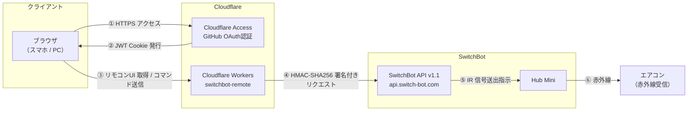
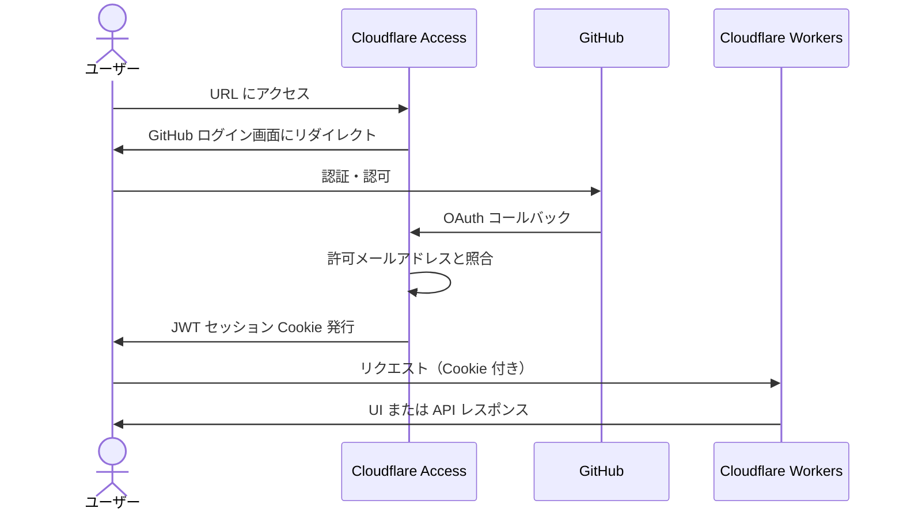
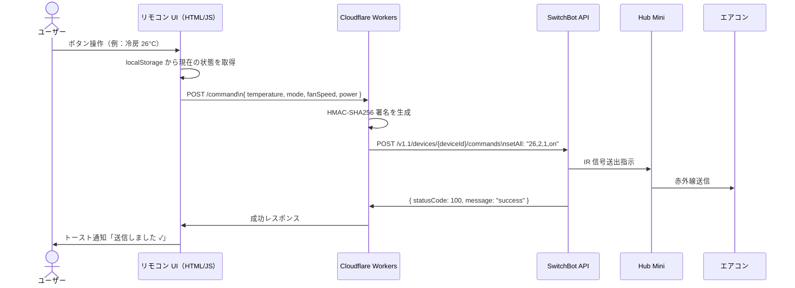

# switchbot-remote

SwitchBot APIとCloudflare Workers/Accessを使ったエアコンWebリモコン。  
GitHub認証付きのURLにアクセスするだけでスマホ・PCから自宅のエアコンを操作できる。


---

## システム全体像



---

## 認証フロー



---

## コマンド送信フロー



---

## 技術選定

| 領域 | 採用技術 | 理由 |
|---|---|---|
| API 中継 | Cloudflare Workers (TypeScript) | エッジで動作・無料枠が大きい・Web Crypto API が使えるため外部ライブラリ不要 |
| 認証 | Cloudflare Access + GitHub OAuth | 設定のみで実装ゼロ・無料枠50ユーザー・個人利用に最適 |
| UI 配信 | Workers Static Assets | Workers と同一オリジンで配信できるため CORS 不要・別途 Pages デプロイも不要 |
| フロントエンド | Vanilla HTML/CSS/JS | 操作UIが単純なためフレームワーク不要・依存ゼロ |
| 状態管理 | localStorage | エアコンは IR のため API からリアルタイム状態取得不可。最後に送信した値をブラウザに保持する |
| HMAC 署名 | Web Crypto API (SHA-256) | Workers ランタイムのネイティブ API。外部ライブラリ不要 |

---

## 制約・既知の仕様

- **エアコンの状態は単方向**  
  Hub Mini は IR 信号を送るだけで、エアコン本体からのフィードバックはない。  
  アプリ側リモコン・本体リモコンで操作した場合、Web UI の表示と実際の設定がズレる可能性がある。

- **温度の相対変更（+1/-1°C）は API 非対応**  
  SwitchBot API のエアコンコマンドは `setAll`（絶対値指定）のみ。  
  温度・モード・風量・電源をまとめて毎回送信する必要がある。

- **1日あたりのAPI呼び出し上限: 10,000回**

- **風量はAPIドキュメント外の値が存在する**  
  公式ドキュメントの風量値は `1=auto, 2=low, 3=medium, 4=high` の4種だが、  
  実機検証により `fanSpeed: 5` が存在し、最大風量として動作することを確認。  
  アプリ上の表示は「自動・風量1・風量2・風量3・風量4」の5択。

- **送風モード（`mode: 4`）はPanasonic AC非対応**  
  APIに送信すると `failed to query command by mode: not match mode` エラーが返る。  
  UIでは `disabled` 表示とし、選択不可にしている。

---

## ディレクトリ構成

```
switchbot-remote/
├── src/
│   └── index.ts          # Cloudflare Workers（API中継）
├── public/
│   └── index.html        # リモコン UI
└── wrangler.toml         # Cloudflare デプロイ設定
```

---

## Workers API 仕様

### `POST /command`

エアコンへ `setAll` コマンドを送信する。

**リクエストボディ**

```json
{
  "temperature": 26,
  "mode": 2,
  "fanSpeed": 1,
  "power": "on"
}
```

| フィールド | 型 | 値 |
|---|---|---|
| temperature | number | 16〜30（°C） |
| mode | number | 1: 自動 / 2: 冷房 / 3: 除湿 / 4: 送風 / 5: 暖房 |
| fanSpeed | number | 1: 自動 / 2: 弱 / 3: 中 / 4: 強 |
| power | string | `"on"` / `"off"` |

**レスポンス例**

```json
{ "statusCode": 100, "body": {}, "message": "success" }
```

---

## セットアップ手順

### 前提条件

- Cloudflare アカウント
- GitHub アカウント（OAuth App 作成済み）
- SwitchBot アカウント（トークン・シークレット発行済み）
- Node.js / npm

### 1. 依存インストール・デプロイ

```bash
cd switchbot-remote
npm install
npx wrangler secret put SWITCHBOT_TOKEN
npx wrangler secret put SWITCHBOT_SECRET
npx wrangler deploy
```

### 2. Cloudflare Access 設定

1. Zero Trust → インテグレーション → ID プロバイダー → GitHub を追加
2. Access コントロール → アプリケーション → 新規作成（Self-hosted）
3. ドメインに `switchbot-remote.<team>.workers.dev` を設定
4. ポリシーで自分のメールアドレスのみ許可
