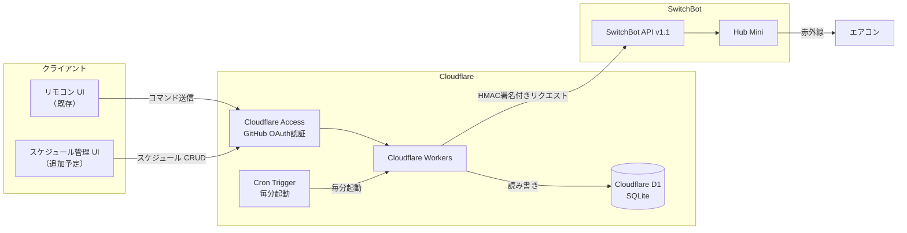
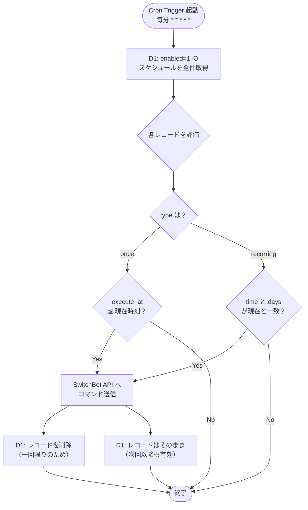

# スケジュール・タイマー機能予定

現時点では未実装。実装前の構成検討メモ。

---

## 全体アーキテクチャ（予定）



---

## Cron 実行フロー



---

## D1 スキーマ

```sql
CREATE TABLE schedules (
  id          INTEGER PRIMARY KEY AUTOINCREMENT,
  label       TEXT    NOT NULL,       -- 例:「朝の起動」
  type        TEXT    NOT NULL,       -- "once" | "recurring"

  -- one-shot タイマー用
  execute_at  TEXT,                   -- "2026-07-15 15:30"

  -- 繰り返しスケジュール用
  time        TEXT,                   -- "07:00"
  days        TEXT,                   -- "0,1,2,3,4,5,6"（日〜土）

  enabled     INTEGER NOT NULL DEFAULT 1,  -- 1=有効 / 0=無効

  -- エアコン設定
  power       TEXT    NOT NULL,       -- "on" | "off"
  mode        INTEGER,                -- 1=自動 / 2=冷房 / 3=除湿 / 5=暖房
  fan_speed   INTEGER,                -- 1=自動 / 2〜5=風量1〜4
  temperature INTEGER                 -- 16〜30
);
```

---

## Workers APIエンドポイント（追加予定）

| メソッド | パス | 内容 |
|---|---|---|
| `GET` | `/schedules` | スケジュール一覧取得 |
| `POST` | `/schedules` | スケジュール新規作成 |
| `PUT` | `/schedules/:id` | スケジュール更新（enabled切り替えも） |
| `DELETE` | `/schedules/:id` | スケジュール削除 |

既存の `POST /command` はそのまま残す。

---

## 追加するUIコンポーネント（予定）

- スケジュール一覧画面
  - 有効/無効トグル
  - 削除ボタン
- スケジュール作成フォーム
  - タイプ選択（一回限り / 繰り返し）
  - 一回限り：日時ピッカー
  - 繰り返し：時刻 + 曜日チェックボックス（月〜日）
  - エアコン設定（電源・モード・温度・風量）

---

## コスト試算

| サービス | 月間消費 | 無料枠 | 費用 |
|---|---|---|---|
| Workers Cron（毎分） | 43,200回/月 | 300万回/月 | 無料 |
| D1 読み取り | 43,200回/月 | 2.5億回/月 | 無料 |
| D1 書き込み | スケジュール実行時のみ | 1億回/月 | 無料 |
| Durable Objects | **不要** | — | — |
